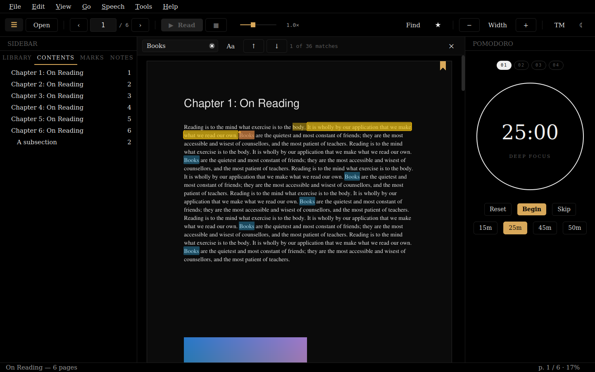
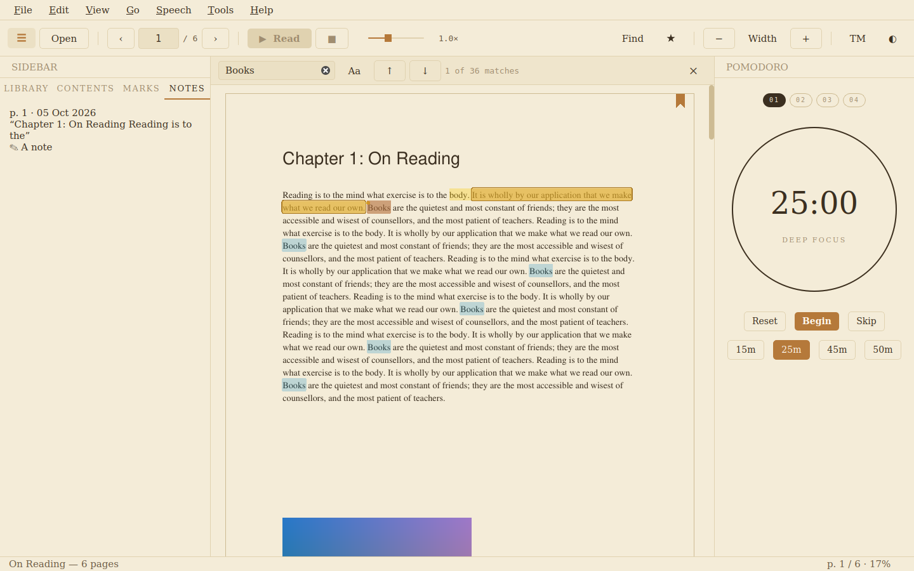
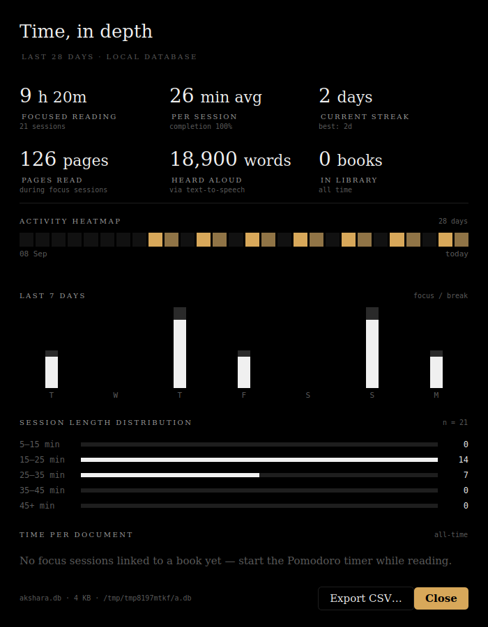

# AKSHARA

A calm Linux PDF reader built for deep reading: natural neural text-to-speech
with sentence highlighting, highlights and notes, a Pomodoro timer, and
private reading analytics. Everything stays on your computer.



## Features

**Reading**
- Smooth continuous scrolling with HiDPI-sharp rendering and a page cache
- Fit width, fit page, or a remembered per-book zoom; Ctrl+scroll zooms at the cursor
- Dark, light and sepia themes, following the desktop setting, the time of day, or your choice.
  Pages are recoloured to match while photos and figures keep their colours
- Table of contents, clickable links, whole-document search (Ctrl+F)
- Reopens every book at the page you left; password-protected PDFs supported
- Focus mode (Ctrl+Shift+F) hides everything but the page

**Read aloud**
- Neural voices via [Kokoro-82M](https://huggingface.co/hexgrad/Kokoro-82M), with the sentence being
  spoken highlighted and followed on screen
- Keeps reading onto the next page, skipping blank pages; read a selection or "read aloud from here"
- Instant pause/stop, adjustable speed, 13 voices (US/UK)
- Falls back to the system speech engine (speech-dispatcher) when neural voices aren't installed

**Notes**
- Word-level text selection; highlights with optional notes; bookmarks with notes
- Export a book's highlights and bookmarks as Markdown

**Focus and analytics**
- Pomodoro timer with configurable lengths, optional auto-start breaks and desktop notifications
- Analytics: 28-day heatmap, last-7-days chart, streaks, session lengths, time per book,
  pages read and words heard, CSV export

| Sepia | Analytics |
|---|---|
|  |  |

## Install

### AppImage (any distro)

Download from the [Releases](https://github.com/shailendrasekhar/akshara/releases) page:

- `Akshara-<version>-x86_64.AppImage` includes the neural voices (large download)
- `Akshara-lite-<version>-x86_64.AppImage` uses system speech; neural voices can be added later
  from **Preferences ▸ Read aloud ▸ Install neural voices…**

```bash
chmod +x Akshara-*.AppImage && ./Akshara-*.AppImage
```

### Flatpak

```bash
flatpak install --user Akshara.flatpak        # bundle from the Releases page
flatpak run io.github.shailendrasekhar.Akshara
```

The Flatpak ships with system speech. Install neural voices from Preferences.

### From source with uv

```bash
git clone https://github.com/shailendrasekhar/akshara.git
cd akshara
uv tool install ".[tts]"                     # drop [tts] for the lightweight reader
packaging/linux/install-desktop-entry.sh     # optional: app menu entry, icon, "Open with"
akshara path/to/book.pdf
```

Or run it in place without installing: `uv run --extra tts akshara`.

On first use, the neural voice model (~330 MB) downloads from Hugging Face; after that it works
offline. An NVIDIA GPU makes synthesis faster, but the CPU is fine.

**System packages:** `libportaudio2` for neural-voice audio output, and optionally
`speech-dispatcher` for the system voice fallback.

## Keyboard shortcuts

| Key | Action |
|---|---|
| `Ctrl+O` / `Ctrl+W` | Open / close document |
| `←` `→`, `Ctrl+Home` `Ctrl+End`, `Ctrl+G` | Previous/next page, first/last, go to page |
| `Space` | Read aloud / pause / resume |
| `Ctrl+R` / `Ctrl+Shift+R` | Read current page / read selection |
| `Esc` | Close find bar, stop reading, or leave focus mode |
| `Ctrl+[` `Ctrl+]` | Slower / faster speech |
| `Ctrl+F`, `F3` | Find, find next |
| `Ctrl+B`, `Ctrl+Alt+↑/↓` | Toggle bookmark, jump between bookmarks |
| `Ctrl+C`, `Ctrl+A` | Copy selection, select all on page |
| `Ctrl++` `Ctrl+-` `Ctrl+0`, `Ctrl+1` `Ctrl+2` | Zoom, actual size, fit width, fit page |
| `Ctrl+T`, `Ctrl+Shift+T` | Cycle theme, cycle interface text size |
| `F9`, `F10`, `F11`, `Ctrl+Shift+F` | Sidebar, Pomodoro panel, full screen, focus mode |
| `Ctrl+P`, `Ctrl+Shift+A`, `Ctrl+,` | Start/pause Pomodoro, analytics, preferences |
| `F1` | All shortcuts |

Right-click the page for copy, highlight, read-from-here and bookmark actions.

## Where data lives

| What | Path |
|---|---|
| Library, sessions, bookmarks, highlights (SQLite) | `~/.local/share/akshara/akshara.db` (override: `AKSHARA_DB`) |
| Preferences | `~/.config/akshara/settings.ini` (override: `AKSHARA_CONFIG`) |
| Neural-voice add-on | `~/.local/share/akshara/tts-addon/` |
| Voice model cache | `~/.cache/huggingface/` |

The database upgrades itself in place when a new version changes the schema.

## Development

```bash
uv sync                                   # app + dev tools (add --extra tts for neural voices)
uv run akshara --no-splash
uv run ruff check . && uv run ruff format --check .
uv run mypy
uv run pytest                             # headless; QT_QPA_PLATFORM=offscreen is set automatically
```

Project layout:

```text
src/akshara/
├── app.py              entry point (CLI, splash, session restore)
├── main_window.py      window, actions, menus, toolbar; wires everything together
├── pdf_viewer.py       continuous-scroll viewer: rendering queue, overlays, selection, links
├── render.py           page rasterisation, theme recolouring, LRU image cache
├── pdf_handler.py      document model: metadata, geometry, text, links, outline, passwords
├── textmap.py          word-level page text ↔ rectangles, sentences, search
├── tts/                speech engines (Kokoro, system), read-aloud controller, voice add-on
├── db.py               SQLite store with versioned migrations
├── settings.py         typed QSettings preferences
├── findbar.py          find bar + incremental search
├── sidebar.py          contents, bookmarks, notes panels
├── library.py          library panel
├── pomodoro.py         Pomodoro panel
├── analytics.py        analytics dialog
└── ui/theme.py         palettes and stylesheet
packaging/
├── appimage/build.sh   AppImage (lite or --with-tts)
├── flatpak/            Flatpak manifest + generated Python deps
├── linux/              desktop entry, AppStream metainfo, icons, user install script
└── make_icons.py       regenerates the icon set from the logo
```

Releases: push a `v*` tag. The release workflow builds the wheel, both AppImages and the
Flatpak bundle, and attaches them to a GitHub release.

## License

MIT
